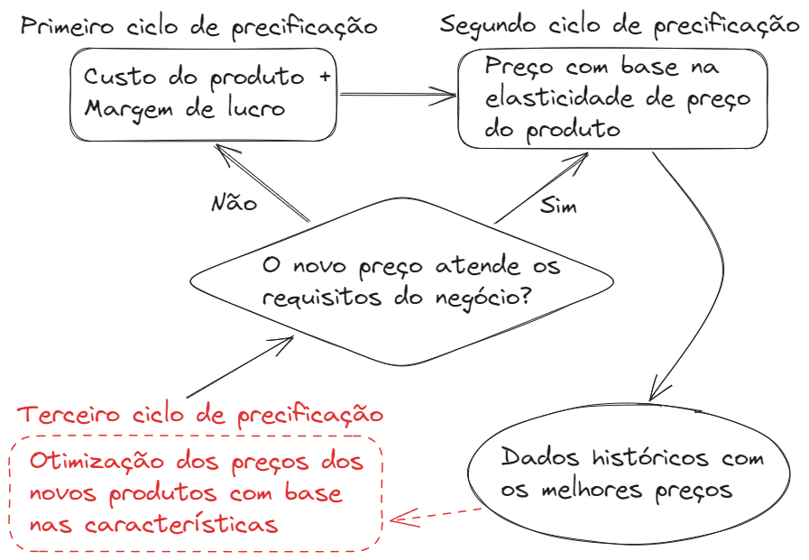
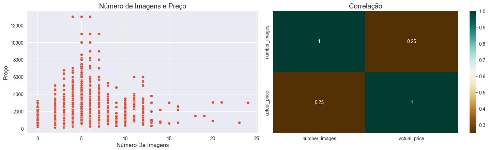
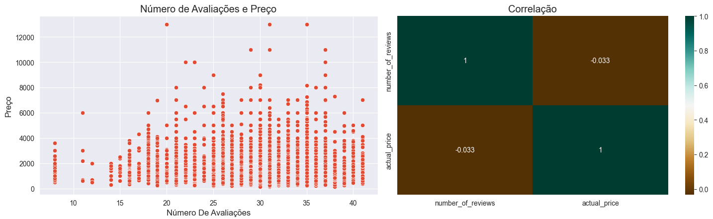
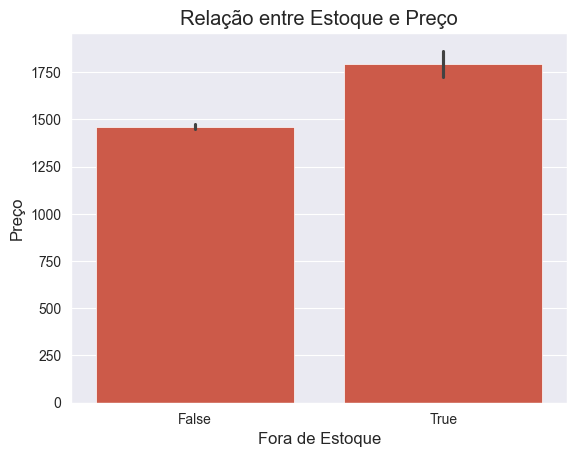
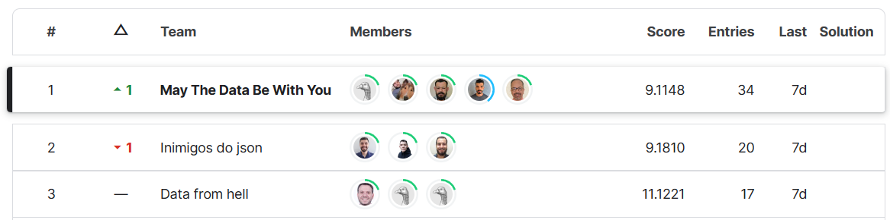

# hackday_6
<h1 align="center"> 6°Hackday Comunidade DS Notebook Vencedor</h1> 

# PREVISÃO DE PREÇOS DE PRODUTOS NO VAREJO DA MODA

# 1. O PROBLEMA DE NEGÓCIO

## 1.1. Descrição do Problema

A empresa Dados & Decotes atua no e-commerce no ramo de moda masculina e feminina com foco em roupas, calçados e acessórios. O desafio atual da varejista é <b>otimizar os preços dos seus produtos</b> de modo a maximizar o lucro nas vendas.

O atual sistema de precificação de produtos tem duas etapas. <b>Primeiro</b> é colocada margem fixa de lucro sobre o preço de custo do produto. Na <b>segunda etapa</b>, após 3 meses de avaliação do comportamento das vendas, os preços são ajustados de acordo com as quantidades demandadas de cada produto.

Na <b>terceira etapa</b> de precificação, a ser implantada com base no resultado dos estudos de nossa Equipe de Cientistas de Dados, os preços dos produtos novos e recém lançados no mercado serão otimizado com base nas suas características, tais como marca, categoria, tecido e outras.

O fluxograma ilustra o processo atual e introdução da nova etapa de precificação.

## 1.2. Objetivo

O desafio da Eequipe de Cientistas de Dados foi encontrar quais deveriam ser os novos preços dos produtos, com base no histórico de preços e características dos produtos de maior sucesso em vendas nas duas primeiras etapas de precificação.

## 1.3. Sumário dos Dados

Segue a descrição da estrutura do dataset:

| COLUNA | Descrição |
|--------|-----------|
| _id | identificador único da linha |
| pid | identificador do produto |
| average_rating | avaliação média do produto |
| number_of_reviews | número de avaliações do produto |
| brand | marca do produto |
| category | categoria do produto |
| crawled_at | data e hora em que o dado foi coletado no site |
| description | descrição do produto |
| images | url das imagens do produto na vitrine |
| out_of_stock | se o produto encontra-se ou não no estoque |
| avg_time_delivery_days | tempo médio de entrega em dias |
| product_details | dicionário contendo detalhes do produto |
| seller | vendedor do produto |
| sub_category | subcategoria do produto |
| fabrication_time | tempo de fabricação do produto em dias |
| title | título do anúncio do produto |
| actual_price | preço atual (variável de resposta) |
(Fonte: Kaggle)

# 2. PLANEJAMENTO DA SOLUÇÃO

## 2.1. Produto Final
São dois os resultados esperados:
1. O desenvolvimento de um procedimento de análise de dados e <i>machine learning</i> projetado para atender as demandas da empresa, e
2. Elaboração de <i>insights</i> relacionados ao negócio, a partir da análise dos dados.

## 2.2. Procedimento

O trabalho foi realizado seguindo o método CRISP-DM1, ou "<i>Cross Industry Standard Process for Data Mining</i>", uma abordagem cíclica objetivando aprimorar a qualidade e agilizar a entrega de resultado em projetos de Ciência de Dados. O método pode ser resumido nas seguintes 4 grandes etapas:
1. Entendimento do negócio
2. Coleta, tratamento e modelagem de dados
3. Algoritmos de <i>Machine Learning</i>
4. Avaliação dos resultados.
(DESENHAR ISSO...)

# 3. DESENVOLVIMENTO

## Estratégia da Solução

## Procedimento

### Passo 1: coleta de dados
### Passo 2: feature engineering
### Passo 3: eda
### Passo 4: Algoritmos de machine learning
### Passo 5: desempenho
### Passo 6: asdf asdf asdf

# 4. OS TRÊS PRINCIPAIS <i>INSIGHTS</i>

## 4.1. Relação entre "número de imagens" e "preço do produto#
A análise dos dados indicou que os produtos com mais imagens possuem preços maiores. A partir deste <i>insight</i>, é possível afirmar que uma campanha de aprimoramento das informações visuais dos produtos pode ter impacto positivo na demanda, e consequentemente no preço.

## 4.2. Relação entre "número de avaliações" e "preço do produto#
A análise dos dados não indicou haver correlação notável entre essas características.

## 4.3. Relação entre "condição do estoque" e "preço do produto"
A análise mostrou uma tendência a terem preços maiores os produtos em falta no estoque. Tal condição pode representar uma estratégia da empresa para administrar o estoque, majorando os preços de produtos que estejam em vias de terem seu estoque zerado.

# 5. RESULTADOS

# 6. CONCLUSÃO

# 7. PRÓXIMOS PASSOS

- Aprimorar a análise dos dados relacionados aos detalhes dos produtos
- Implementar otimização baseada no estoque
- Aprimorar a etapa de <i>feature engineering</i>
- Implementar outros modelos. Ex: redes neurais.

# 8. EQUIPE DE DESENVOLVEDORES

O trabalho foi desenvolvido durante o 6º Hackday da Comunidade DS, competição de Ciência de Dados ocorrida nos dias 21.22/outubro/20232.

Os participantes da equipe foram:
- Edilson Santos
- Aroldo Brancalhão
- Leonardo Rose
- Manoel Mendonça
- M.Alessandro Fonseca

O presente trabalho conquistou o 1º lugar na competição Hackday da Comunidade DS, tanto no critério de redução do erro (conforme leaderboard do Kaggle), quanto no critério de votação pelos pares. Abaixo, o quadro do Kaggle com as equipes que apresentaram melhor desempenho.

# REFERÊNCIAS:
1. Sobre o Método CRISP-DM: https://www.escoladnc.com.br/blog/data-science/metodologia-crisp-dm/
2. site da comppetição no Kaggle: https://www.kaggle.com/competitions/product-price-predicition-20/overview

